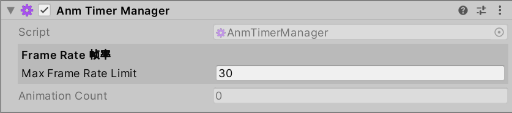

# Anm2 Animation Player For Unity

## 介绍 | Intro

本仓库是我为以撒Anm2动画导入到Unity引擎中而制作的兼容小工具。 | This repository is a compatibility utility I made for importing Isaac's Anm2 animations into the Unity engine.

目前已经完善了基础功能，可以以二维独立游戏动画播放器的形式使用。 | The basic functions have been completed and can be used as a 2D inde game animation player.

## 引擎与插件前置 | Engine and Plugins Required

Unity测试版本为`2022.3.43f1c1`，尚未测试其他版本引擎。 | Unity test version is `2022.3.43f1c1`, and other engine versions have not been tested yet.

本项目需要的额外Unity包： | Additional Unity packages required for this project:  
- `Shader Graph` `[14.0.11]`
- `Universal RP` `[14.0.11]` (可选) (Optional)

本项目所使用的第三方插件： | Third-party plugins used in this project:
- `Naughty Attributes` [2.1.4]

注意：`Naughty Attributes`暂未在本仓库中进行分发，所以你需要在[这里](https://github.com/dbrizov/NaughtyAttributes)进行安装。 | Note: `Naughty Attributes` is not distributed in this repository, so you need to install it [here](https://github.com/dbrizov/NaughtyAttributes).

## 特性 | Features

### Anm管理器 | Anm Managers

1. `AnmTimerManager`
	- Anm全局计时器管理器 | Anm global timer manager
	- 场景单例，需要手动实例化在场景中。 | Scene singleton, needs to be manually instantiated in the scene.
	- 负责集中管理所有动画的计时器更新。 | Responsible for centrally managing the timer updates for all animations.

2. `AnmDataHandler`
	- Anm全局数据分发器 | Anm global data distributor
	- 场景单例，需要手动实例化在场景中。 | Scene singleton, needs to be manually instantiated in the scene.
	- 全局数据共享管理器，用于配置全局信息。 | Global Data Sharing Manager for configuring global information.

3. `AnmCacheManager`
	- Anm文件缓存管理器 | Anm file cache manager
	- 场景单例，需要手动实例化在场景中。 | Scene singleton, needs to be manually instantiated in the scene.
	- 将动画文件信息缓存在内存中，避免频繁读取。 | Cache the animation file information in memory to avoid frequent reading.

### Anm播放器 | Anm Players

1. `AnmSprite`
	- Anm基础动画播放器 | Anm basic animation player
	- 用于Anm动画在游戏物体上的播放。 | Used to play Anm animations on game objects.

2. `AnmFileRuntime`
	- Anm文件快捷导入器 | Anm file quick importer
	- 当`AnmSprite`的`AutoLoadFilePath`为`Component`时，可以以`AutoLoadAnmFile`来设置项目中的文件。 | When `AnmSprite`'s `AutoLoadFilePath` is set to `Component`, you can use `AutoLoadAnmFile` to set the file in the project.

3. `AnmFrameDroppingLevels`
	- Anm跳帧等级表 | Anm frame dropping levels config
	- 当`AnmSprite`的`UseFrameDroppingLevels`为`true`时，可以以`FrameDroppingLevel`来设置等级配置表。 | When `UseFrameDroppingLevels` of `AnmSprite` is `true`, the frame dropping level can be set via the `FrameDroppingLevel` configuration table.

4. `AnmRootLayerRuntime`
	- Anm动画的根图层组件 | Anm animation's root layer component
	- 用于设置根图层。 | Set the root layer.

5. `AnmSpriteLayerRuntime`
	- Anm动画的图集图层组件 | Anm animation's sprite sheet layer component
	- 用于设置图集图层。 | Set the sprite sheet layer.

6. `AnmNullLayerRuntime`
	- Anm动画的空图层组件 | Anm animation's null layer component
	- 用于设置空图层。 | Set the null layer.

### 测试 | Test

1. `AnmDebug`
	- Anm文件解析测试组件 | Anm File Parsing Test Component
	- 可以尝试解析Anm2文件中的数据。 | You can try parsing data from Anm2 files.

## 演示场景 | Demo

1. Demo1_SpriteDrive
   - 代码驱动动画测试 | Code-driven animation testing
   - 在该场景中，展示了多种不同的动画播放方法，还有一套完整播放流程的代码控制演示。 | This scene demonstrates various different animation playback methods and a complete playback process code control example.

2. Demo2_Character
   - 玩家角色动画测试 | Player character animation testing
   - 通过使用角色控制器的方式来控制动画的播放，并展示了与Unity原生Animator动画状态机的兼容。 | Controlling animation playback through a role controller and demonstrating compatibility with Unity's native Animator state machine.

3. Demo3_CPUPressure
   - 大量动态实例化动画物体测试 | Massive dynamic instantiation animation objects test
   - 对比使用预热缓存功能前后的物体生成速度。 | Compare the object generation speed before and after using the preheating cache feature.

4. Demo4_CPUPressure2
   - 大量静态（静帧）实例化动画物体测试 | Massive static (still frame) instantiation animation objects test
   - 对比不同着色器对运行速度的影响。 | Comparing the impact of different shaders on performance.

## 关于Anm2动画编辑器 | About Anm2 Animation Editor

Anm2 Animation Editor本体v1.0是由Adrian Gavrilita进行开发的，用于PC游戏《以撒的结合：重生》内部实体动画的编辑。 | Anm2 Animation Editor v1.0 is developed by Adrian Gavrilita for editing internal entity animations in the PC game: the Binding of Isaac: Rebirth.

当在Steam上安装了《以撒的结合：重生》与DLC“Afterbirth”及“Afterbirth+”后，可在游戏安装目录中的`tools/ResourceExtractor/`找到`ResourceExtractor.exe`进行游戏解包。 | After installing the Binding of Isaac: Rebirth with the DLC "Afterbirth" and "Afterbirth+", you can find `ResourceExtractor.exe` in the game installation directory's `tools/ResourceExtractor/` folder to unpack the game.

在游戏安装目录中的`extracted_resources/resources/gfx`路径中可以找到游戏所使用的anm2动画配置文件。 | The anm2 animation configuration files used by the game can be found in the path `extracted_resources/resources/gfx` within the game installation directory.

可以将这些配置文件使用之前`tools`文件夹中的`IsaacAnimationEditor/`路径里的动画编辑器进行编辑。 | These configuration files can be edited using the `IsaacAnimationEditor/` located at the path in the `tools` folder.

你也可以使用民间开发的Anm2动画编辑器更新版本进行编辑：[Anm2Ed](https://github.com/ShweetsStuff/anm2ed) | You can also use the civilian-developed Anm2 animation editor updated version for editing: [Anm2Ed](https://github.com/ShweetsStuff/anm2ed)

## 版权声明 | Copyright Notice

本项目为原始档案，作者：Iamsleepingnow。日期：2025.10.08。  
This project is the original archive, developed by "Iamsleepingnow". Date: Oct. 8th, 2025

## 许可证 | License

本项目代码受 [GNU GPL v3.0](https://www.gnu.org/licenses/gpl-3.0.html) 协议保护。 | The code of this project is licensed under the [GNU GPL v3.0](https://www.gnu.org/licenses/gpl-3.0.html) license.

本项目所使用的字体文件`fusion-pixel-12px-proportional-zh_hans.ttf`受 [SIL OPEN FONT LICENSE v1.1](https://openfontlicense.org) 协议保护。Copyright (c) 2022, TakWolf。 | The font file used in this project `fusion-pixel-12px-proportional-zh_hans.ttf` is protected by the [SIL OPEN FONT LICENSE v1.1](https://openfontlicense.org) agreement. Copyright (c) 2022, TakWolf.
